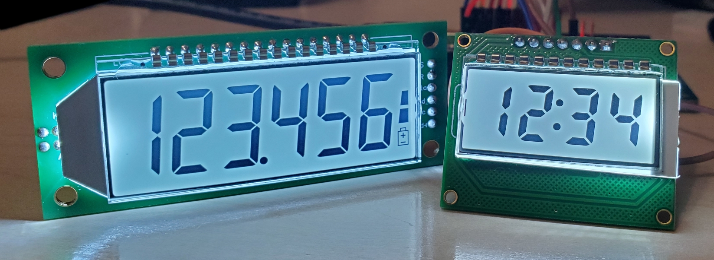
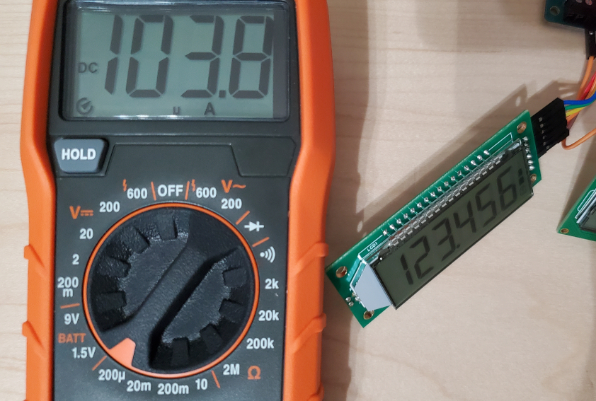

# HT1621 7 segment LCD Arduino library

Arduino library for 7-segment LCDs based on the HT1621 driver, with support for 4-digit displays and various low power modes. Often marked as PDC-6X1 (6-digits) or LCM0220 (4-digits).

Based on the bitbanging efforts by [anxzhu](https://github.com/anxzhu) (2016-2018).  

APIs rewritten in 2018 to follow the LiquidCrystal format by [valerionew](https://github.com/valerionew).

Rewritten again by [kreddkrikk](github.com/kreddkrikk/ht1621) with support for 4-digit displays and low power modes.

## API reference

* `void begin(int width, int cs_p, int wr_p, int data_p)`
Activate the display. Acceptable values for width are 6 for 6-digit displays and 4 for 4-digit displays.

* `void begin(int width, int cs_p, int wr_p, int data_p, int backlight_p)`
Activate the display with backlight control.

* `void powerDown()`
Power down the display. This reduces power consumption to <0.1uA.

* `void powerUp()`
Bring the display out of power down status.

* `void standBy()`
Turn off MCU pins, but keep the display active. This reduces power consumption by about 100uA. The display cannot be updated while in standby mode until active() is called.

* `void active()`
Come out of standby mode to update the display.

* `void clear()`
Clear the display.

* `void lcdOn()`
Turn the display on.

* `void lcdOff()`
Turn the display off.

* `void backlightOn()`
Turn on the backlight.

* `void backlightOff()`
Turn off the backlight.

* `void print(const char* str)`
Base function for all other print functions.

* `void print(double num, int precision)`
Print floating value, right-aligned.

* `void print(int num)`
Print 16-bit integer, right-aligned.

* `void print(long num)`
Print 32-bit integer, right-aligned.

* `void printTemp(double num, char unit, bool degree)`
Print the temperature, optionally including degree symbol and unit. Set `unit` to NULL to hide the unit symbol.

* `void printTime(bool pad, int num1, int num2)`
Print clock/timer number pair separated by colon or decimal, with the first number optionally padded by leading zeros.

* `void printError(int err)`
Print an error code to the display.

* `void batteryLevel(int level)`
Set the battery indicator.

## Standby mode

Current draw for an active display can be reduced to ~100uA using standby mode and running the display from a 3.3V power source. If operating the display from a microcontroller running at <10uA, two AAA batteries (3.0V, 2400mAh) would theoretically power such a setup for ~2.5 years.
